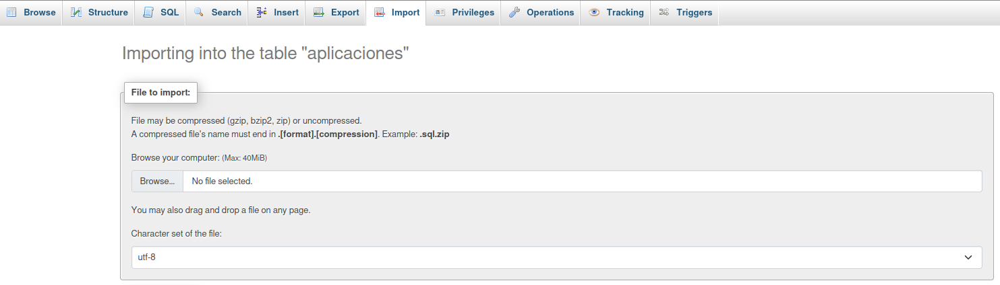

# Documentacion de la aplicacion bolsa de trabajo
Generalmente siguiendo las buenas practicas de programacion todo el codigo de la
aplicacion se encuentra documentado con comentarios para explicar que es lo que 
hace cada clase y metodo de nuestra aplicacion


## Como iniciar el proyecto
Para poder replicar el proyecto deberas de tener un servidor local configurado
en este caso recomiendo tener XAMP instalado.

1. Instala xammp
[XAMP](https://www.apachefriends.org/es/download.html)

Una vez tengas el servidor instalado en tu equipo dirigete a la carpeta htdocs que 
se crea en el disco C: de tu ordenador dentro de la carpeta xamp.

2. Clona el repositorio en la carpeta htdocs de XAMP con el siguiente comando:
```bash 
git clone https://github.com/iesfuengirola1es/proyectointegrado2t2024-DiosTeOdia.git
```

3. Inicia los servidores Apache y Mysql

Ya que se encuentra clonado el proyecto en la carpeta htdocs deberas de crear
la base de datos por lo que deberas prender el servidor de xamp apache y mysql
luego dirigete al navegador y coloca la siguiente ruta en el buscador

```
http://localhost/phpmyadmin/
```
En esta direccion encontraras la ruta a una interfaz sencilla de mysql 
asi que toma el archivo bolsa_trabajo de la carpeta raiz y importala en esta interfaz.


Si se han realizado bien los pasos anteriores podras ver la aplicacion funcionando en esta ruta

```
http://localhost/proyectointegrado2t2024-DiosTeOdia/bolsa-trabajo/
```


## Descripcion

Se trata de una aplicacion que hace la funcion de una bolsa de trabajo
en la cual los usuarios pueden registrarse y postularse a las ofertas de trabajo
que se encuentren disponibles en la aplicacion.

La aplicacion trata de implementar el patron de diseño MVC (Modelo Vista Controlador)
a un nivel simple para manterner la organizacion del codigo y optimizar el desarrollo.

Explico un podo como esta implementado
Dentro del proyecto encontramos los siguientes directorios

**controllers** -> Intermediario entre nuesto modelo y vistas.

**models** -> Aqui se encuentra la logica de consulta de nuestros usuarios.

**views** -> Aqui se encuentran las vistas correspondientes a nuestra aplicacion.

**lib** -> Aqui se encuentra las clases basicas de las cuales eredamos a nuestras demas clases
en los anteriores directorios mencionados.

En el archivo **App**.php
Aqui se encuentra la logica implementada para manejar las rutas de la aplicacion
y la redireccion a de los controladores

En **index.php** se encuentra la carga de nuestras clases para iniciar la aplicacion

**config**
En el directorio config se encuentra un archivo con constantes necesarias
en nuestra aplicacion

**.htaccess**
Aplica las reglas de configuracion del servidor


  
## Estructura de directorios

```
|── bolsa-trabajo
│  ├── controllers
│  ├── lib
│  │  └── app.php
│  ├── models
│  ├── public
│  │  └── css
|  |  |_js
|  |  |_images
│  └── views
│  └── config
|  ├── index.php
|  ├── README.md
```

## Tecnologias utilizadas

- HTML
- CSS
- JavaScript
- PHP
- MySQL
- Tailwind CSS
