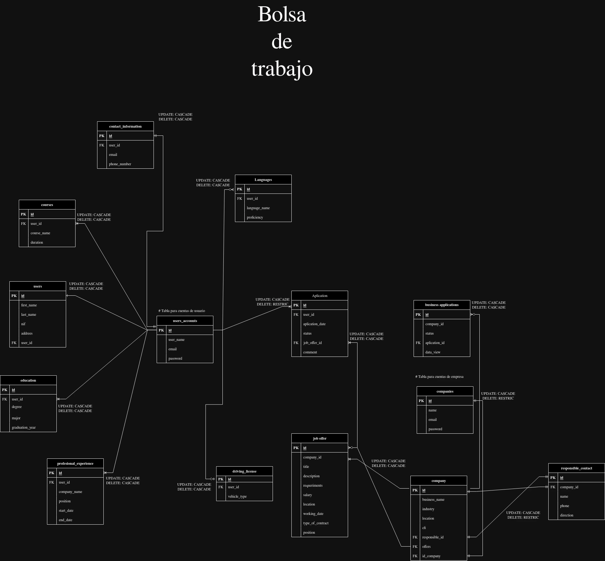

## Diseño de base de datos entidad relacion

## Tablas

### users_accounts

Esta tabla se encarga de almacenar los datos de los usuarios que se registran en la aplicacion y servira para manejar el inicio de sesion.

Apartir de esta tabla los datos tendran relacion con tablas que seran utilizadas para almacenar los datos de contacto del nuestro usuario estas tablas son las siguientes:

- contact_information
- courses
- users
- education
- profesional_experience
- driving_license
- languages

Estas tablas estan directamente relacionadas con la tabla users_accounts ya que se encargan de almacenar los datos de contacto del usuario que seran enviados posteriormente a las empresas que apliquen para trabajar.

### aplication

Esta tabla esta relacionada con la tabla users_accounts ya que se encarga de almacenar las aplicaciones que los usuarios realizan a las ofertas de trabajo que las empresas publican y servira para enviar los datos a la empresa para que las pueda revisar.

### job_offers

Esta tabla se encargara de manejar las ofertas de trabajo publicadas por nuestras empresas registradas

### companies

Esta tabla se encargara de almacenar los datos de las empresas que se registran en la aplicacion y servira para manejar el inicio de sesion de las empresas.

### company

Esta tabla tendra la informacion general de nuestra empresa registrada para manejar los perfiles de las empresas.

### responsble_contact

Esta tabla se encargara de almacenar los datos de contacto de la empresa que se registran en la aplicacion y servira para manejar el contacto con las empresas.

Es una base de datos sencilla que maneja las relaciones de las tablas de manera correcta para que la aplicacion funcione de manera correcta, obviamente puede a estar sujeta a cambios con el avance del desarrollo en el proyecto.
